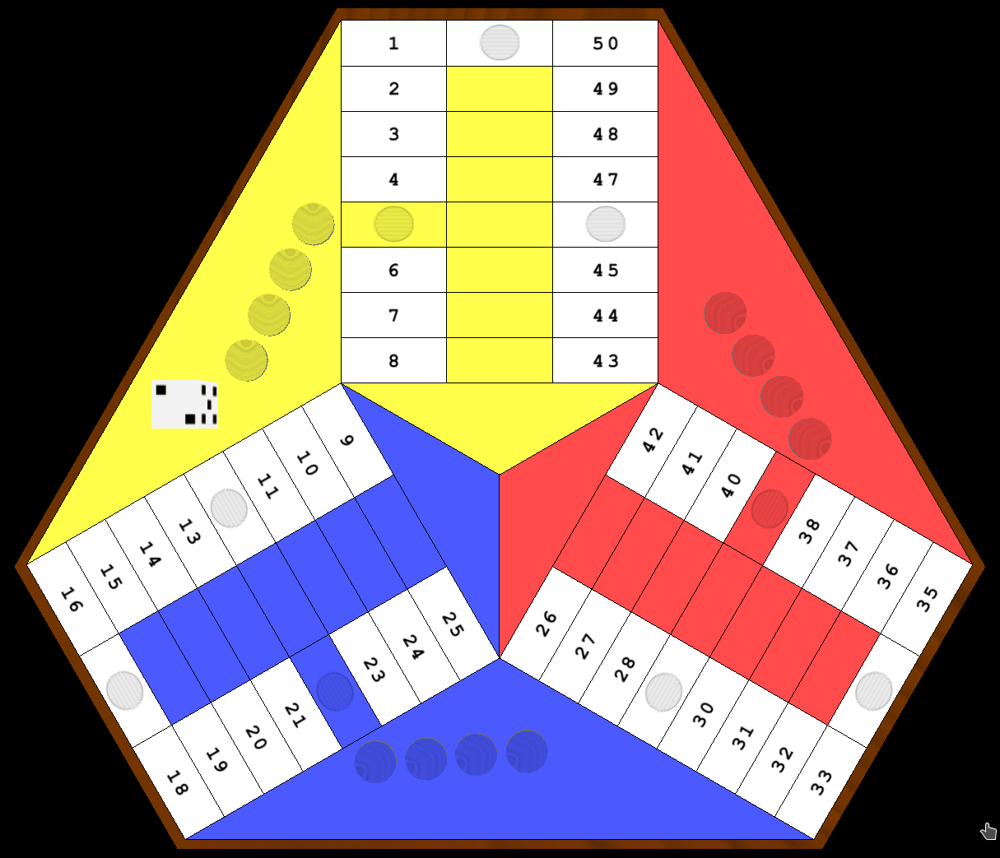
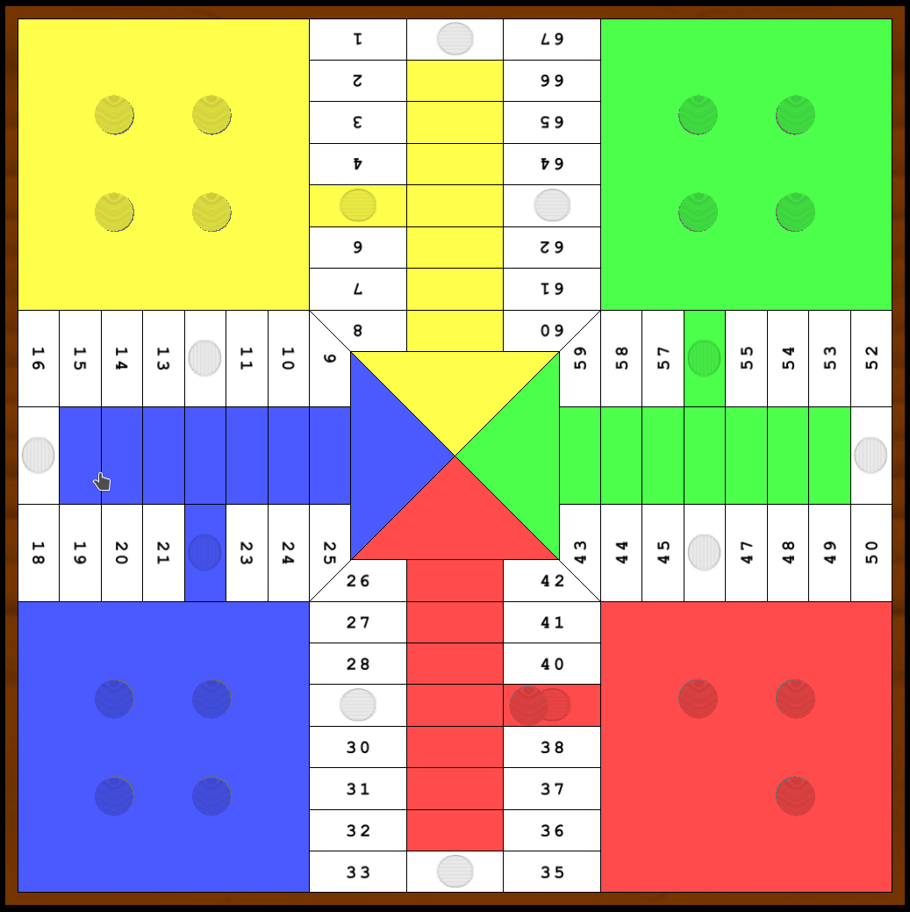
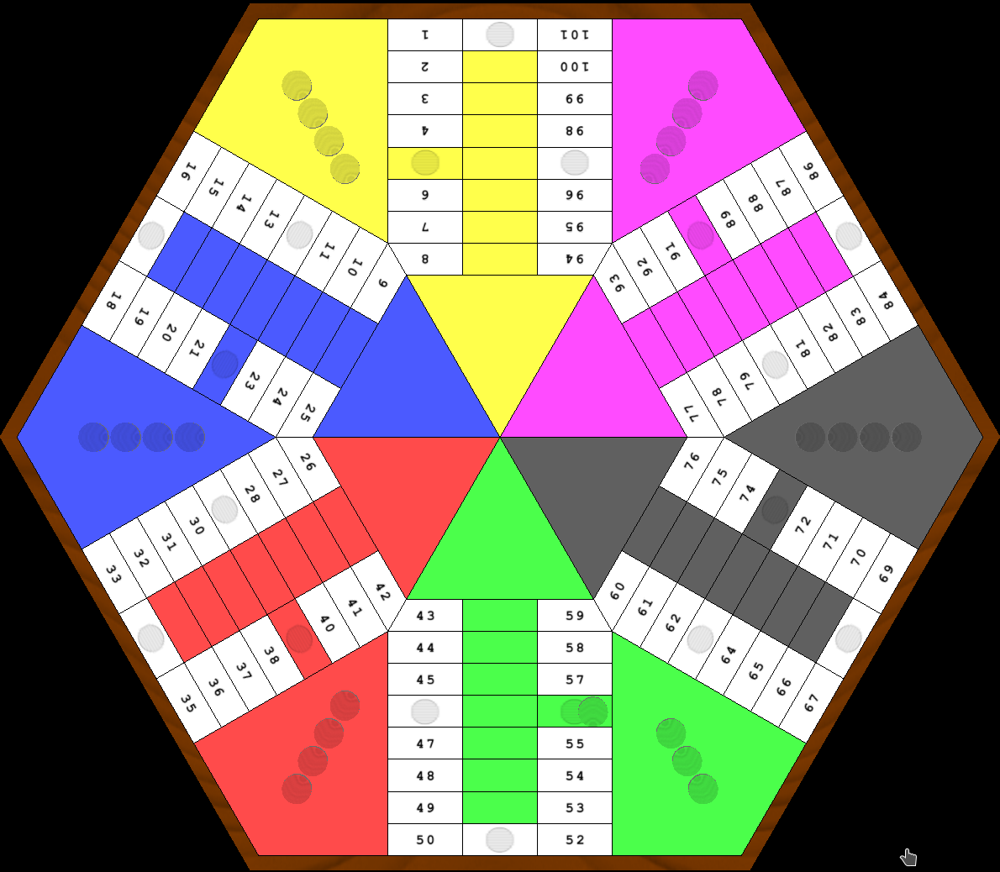
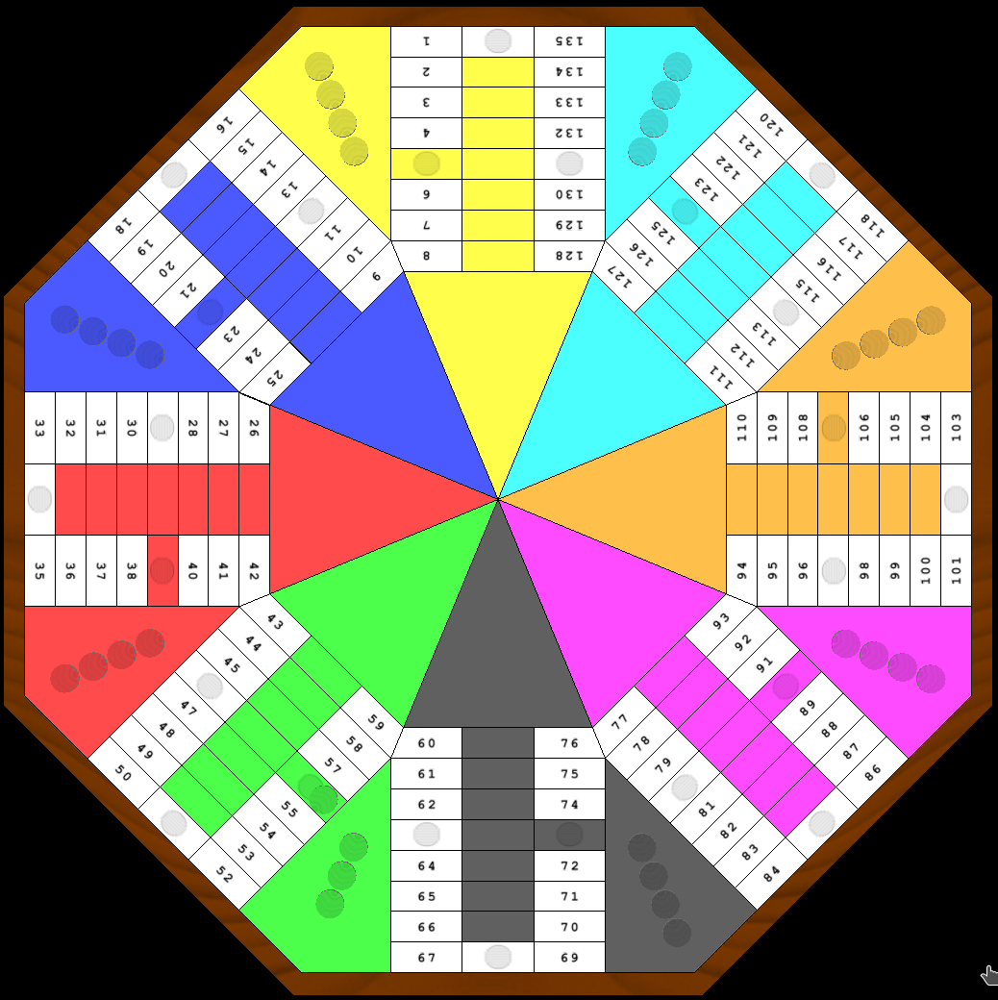

# glParchis  

## Project links

Glparchis doxygen documentation:
    https://coolnewton.mooo.com/doxygen/glparchis/index.html

Game statistics
    http://glparchis.sourceforge.net/php/glparchis_statistics.php

## Snapshots

   

## Install in Linux

If you use Gentoo you can find a ebuild in https://github.com/Turulomio/myportage/tree/master/games-board/glparchis

If you use other distribution compatible con pip, you need to run:

`pip install glparchis`

## Install in Windows as a python module

You need to install Python from https://www.python.org and add it to the PATH

You must open a console with Administrator privileges and type:

`pip install glparchis`

If you want to create a Desktop shortcut to launch glParchis you must write in console:

`glparchis_shortcuts.exe`

## Install in Windows as a standalone application

You need to download glparchis-X.X.X.exe from github release

Just execute it

## Dependencies

* https://www.python.org/, as the main programming language.
* https://pypi.org/project/PyQt5/, as the main library.
* https://pypi.org/project/pywin32/, to create shortcuts.
* https://pypi.org/project/PyOpenGL/, for OpenGL api.

## Authors

* Turulomio: Idea and development. English and spanish translations.
* Nadejda Adam: French translation

## Changelog

Please read the [CHANGELOG](CHANGELOG.md)
